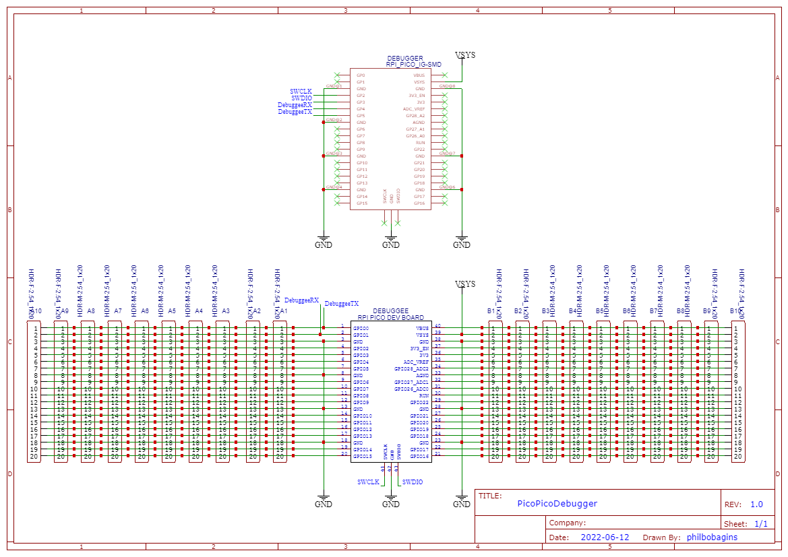

Pico Pico Debugger
==================

PCB to help debug a RPi Pico with another RPi Pico.

TODO
----

* Photo of completed board
* Add silkscreen lines linking the breadboard style pads that are linked by traces
* Better footprint for SMT Pico board:
    * needs keepouts for pads on bottom of Pico
    * needs cutouts for USB connector
* 3D models for Pico boards
* More room for serial number and build date?
* Documentation
    * https://www.digikey.bg/en/maker/projects/raspberry-pi-pico-and-rp2040-cc-part-2-debugging-with-vs-code/470abc7efb07432b82c95f6f67f184c0
    * https://www.raspberrypi.com/documentation/microcontrollers/raspberry-pi-pico.html
* Software examples
* Reset button for "debuggee" board?
* Is "debuggee" a sensible name?

Licence
-------

Copyright © 2022 Phil Baldwin

This work is licensed under a Creative Commons Attribution-ShareAlike 4.0 International License.

You should have received a copy of the license along with this work. If not, see http://creativecommons.org/licenses/by-sa/4.0/.
